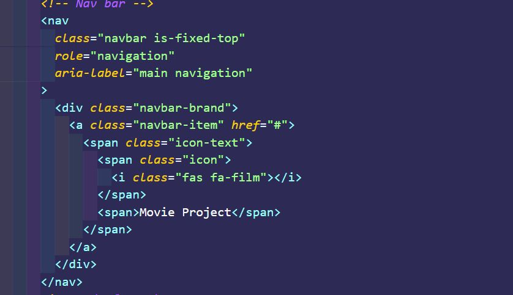
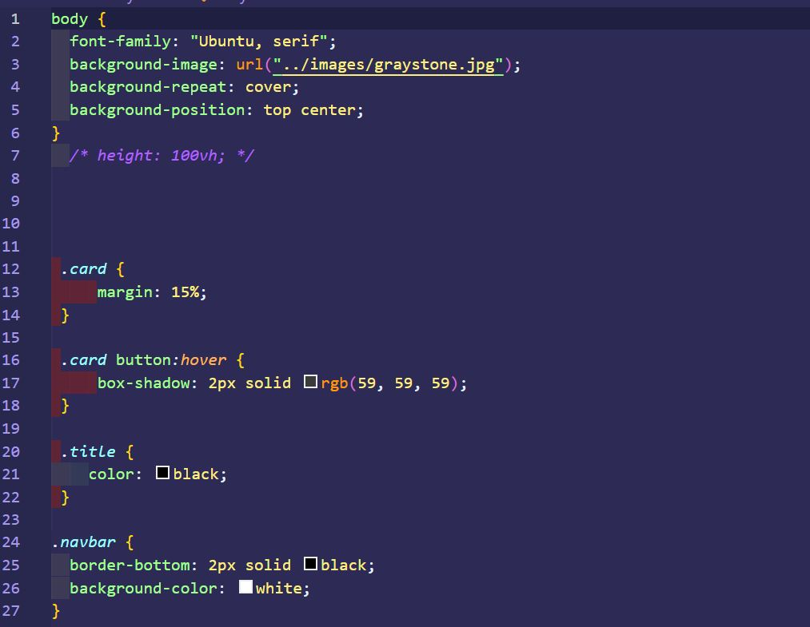
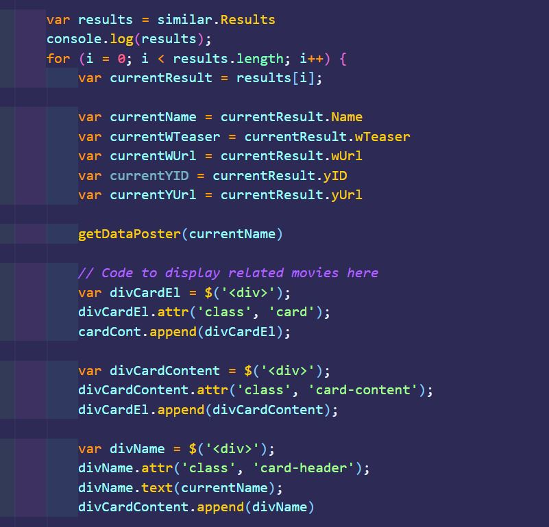
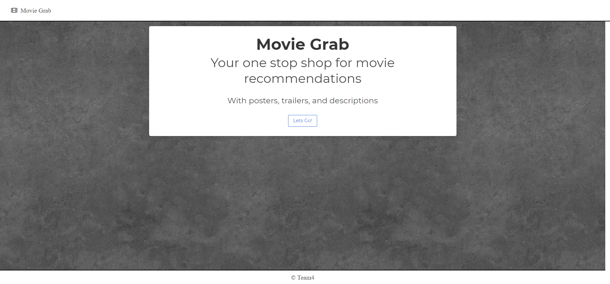
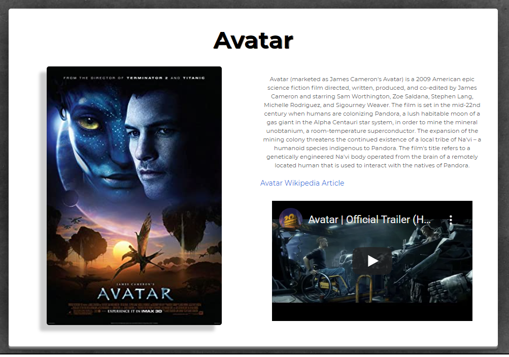
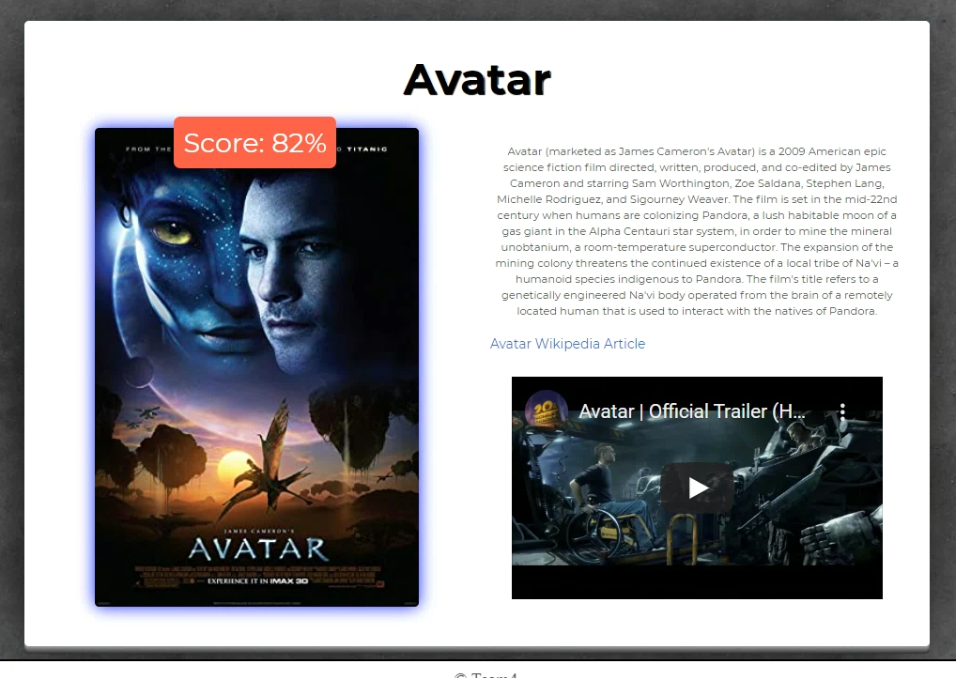
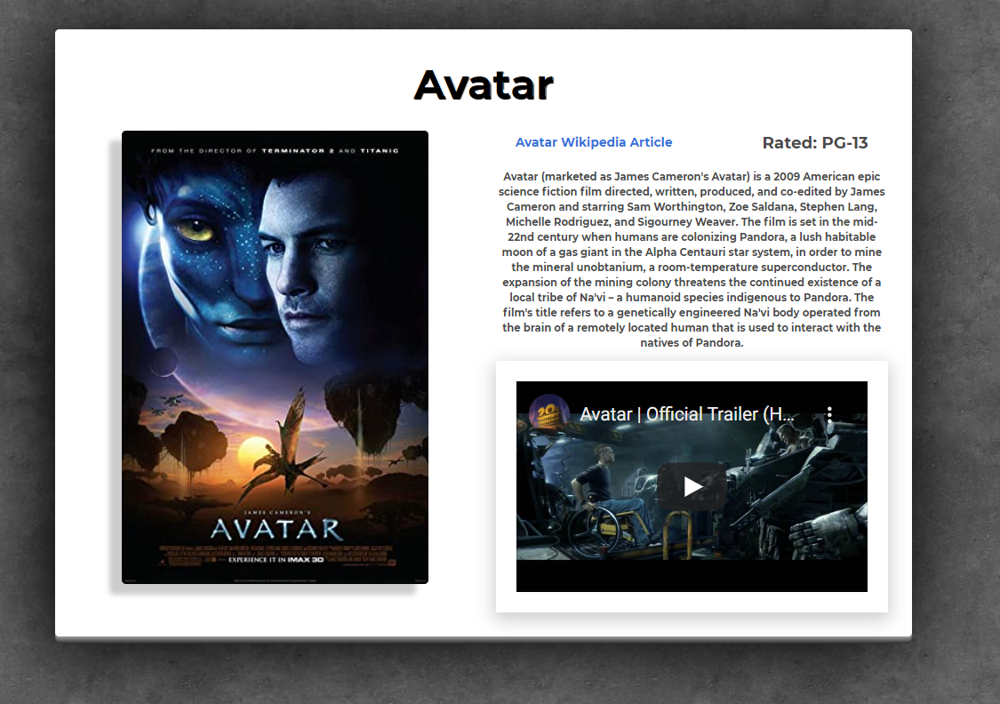

#Project-1
## Introduction:
 [The Movie Grab](https://ttdunlap33.github.io/movie-project/)

## User Story
```It’s movie night. I feel I have exhausted all my entertainment options between TV and streaming services.I just want some recommendations based off of my favorite movies. That will display the top 5 recommendations. That also provides a poster, a brief description of the movie from wikipedia and an accompanying movie trailer for my convenience. ```

## Criteria
Project 1 was to build web applications from scratch. With a team, to conceive and execute a design by integrating data received from multiple server-side API requests. While working collaboratively, to learn agile development methodologies and implement features and bug fixes using the git branch workflow and pull requests.


## Technologies used:
* HTML
* CSS
* Java Script
* Jquery
* Bulma

## Contributors:
* Thomas Dunlap
* Cody Gallagher
* Trevor Bruce
* Ariel Marchand


## Api’s used:
* [Taste Dive API](https://tastedive-api-documentation.readthedocs.io/en/latest/index.html)

* [OMDB API](http://www.omdbapi.com/)

## Created HTML  Code


### Created CSS



### Created JS, Jquery, Api



## Final product screenshots








[](https://opensource.org/licenses/MIT)